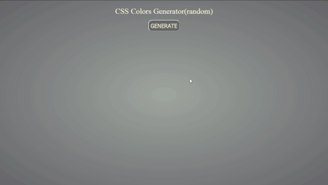
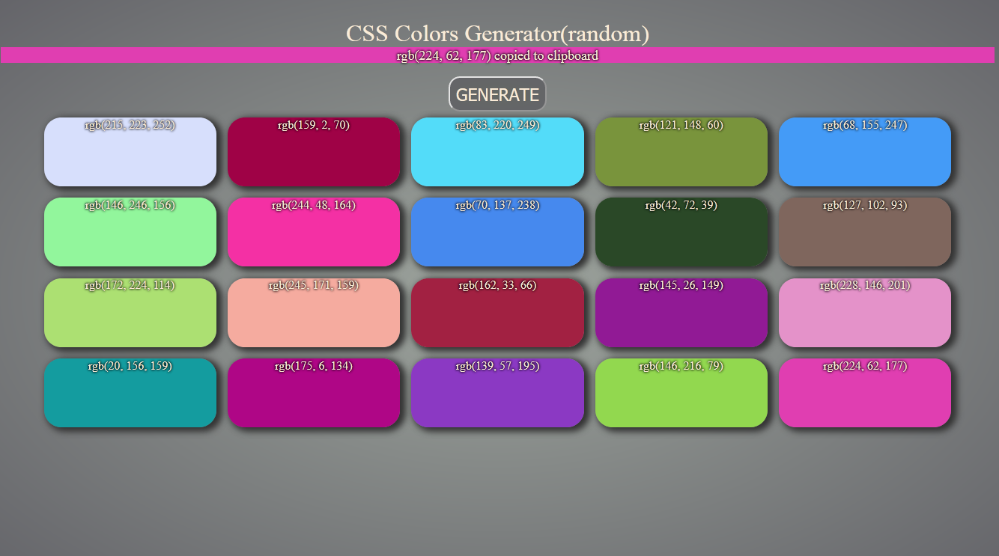

# Random-RGB-Color-Generator
HTML page for generating random colors with RGB value

 

* just an helper when random color is needed.
* 16,777,216 different color values can be generated
r(256) x g(256) x b(256)

* on every color div current rgb color value is displayed
* added onclick function on every color to copy it's value to the clipboard

